<p align="center">
  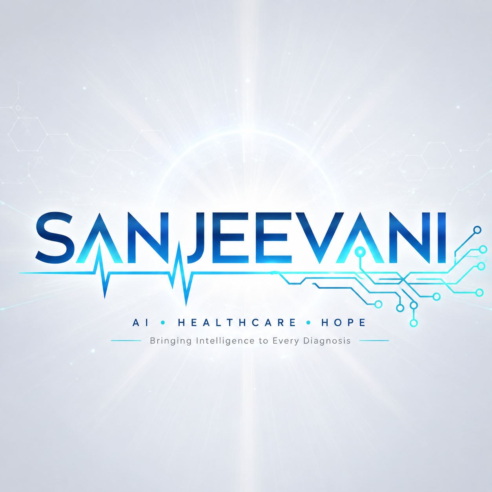
</p>

<h1 align="center">Sanjeevani</h1>

<p align="center"><strong>Rare Disease Triage & Clinical Decision Support</strong><br/>
Doctor-reviewed AI triage, phenotype scoring, and patient-safe referral generation</p>

<p align="center">
  
  
  
  
  
  
  
  
  
  
  
  
  
</p>

---

## Table of Contents

- [Overview](#overview)
- [The Problem](#the-problem)
- [Architecture](#architecture)
- [Key Features](#key-features)
- [Product Screenshots](#product-screenshots)
- [Doctor-in-the-Loop](#doctor-in-the-loop)
- [Patient Workflow](#patient-workflow)
- [Doctor Workflow](#doctor-workflow)
- [Quick Start](#quick-start)
- [Environment Configuration](#environment-configuration)
- [Repository Structure](#repository-structure)
- [Authentication & Authorization](#authentication--authorization)
- [FAQ](#faq)
- [Related Documentation](#related-documentation)
- [License](#license)

---

## Overview

**Sanjeevani** (codebase: *Lumina*) is a clinical decision-support platform designed to shorten the rare disease diagnostic odyssey. It converts scattered clinical notes, lab reports, genetic VCF files, and medical photographs into doctor-reviewed **Human Phenotype Ontology (HPO)** findings, ranks candidate rare diseases against Orphanet/HPO knowledge graphs, and generates single-page specialist referral letters.

300 million people worldwide live with a rare disease. Getting a diagnosis takes an average of **5 years**, **8 doctors**, and multiple misdiagnoses — because no human clinician can memorize 7,000+ rare diseases. Sanjeevani turns scattered patient evidence into structured diagnoses and specialist referral letters in **minutes instead of years**.

> **Presenting at a hackathon?** Read the complete 3-minute pitch script in [pitch.md](pitch.md). For the full file map and architecture notes, see [prd.md](prd.md).

---

## The Problem

| Statistic | Impact |
| --- | --- |
| 300M+ people | Worldwide live with a rare disease |
| 5 years | Average time to diagnosis |
| 8 doctors | Typical number of clinicians consulted |
| 7,000+ diseases | In the Orphanet rare disease database |

Sanjeevani addresses this by ingesting **multimodal clinical evidence** — notes, photos, lab reports, and genetic VCFs — extracting HPO phenotype terms, scoring candidates with deterministic ontology metrics, and producing clinician-approved referral documentation.

---

## Architecture

<p align="center">
  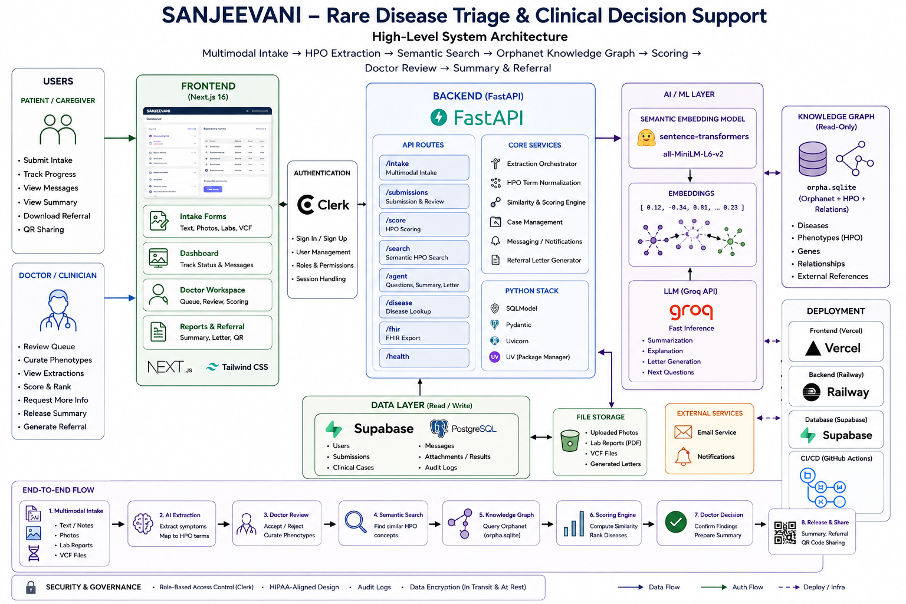
</p>

**Stack summary**

| Layer | Technologies |
| --- | --- |
| **Frontend** | Next.js 16, Tailwind CSS, React, next-intl (7 locales) |
| **Backend** | FastAPI, Python 3.12+, SQLModel, Pydantic, Uvicorn, uv |
| **Auth** | Clerk (roles, sessions, OAuth) |
| **AI / ML** | Groq API (LLM), sentence-transformers `all-MiniLM-L6-v2` (HPO semantic search) |
| **Data** | Supabase PostgreSQL (app state), `orpha.sqlite` knowledge graph (Orphanet, HPO, ClinVar) |
| **Deploy** | Vercel (web), Railway (API), GitHub Actions (CI) |

**End-to-end flow:** Multimodal intake → AI extraction → Doctor review → Semantic search → Knowledge graph query → Scoring engine → Doctor decision → Release & share (summary, referral, QR).

---

## Key Features

1. **Multimodal Intake** — Upload clinical notes (with voice), photos, lab reports (PDF/OCR), and genetic VCF files in a single case.
2. **Doctor Phenotype Review** — Interactive accept/reject chips for every AI-suggested HPO term before scoring.
3. **Ontology Differential Scoring** — Ranks 7,000+ rare diseases using Information Content, Jaccard, and Lin semantic distances plus genetic variant weighting.
4. **Specialist Referral Generator** — Editable single-page referral letter (Markdown & PDF) for specialist handoff.
5. **Patient Dashboard** — Safe portal with doctor-released summaries and referral letters; raw scorecards hidden.
6. **QR Patient Sharing** — Opaque QR codes for consent-gated, audited access to longitudinal history at point of care.
7. **Curated Demo Suite** — 12 pre-loaded clinical cases for live judging and testing.
8. **Multilingual UI** — English, Hindi, German, French, Spanish, Chinese, and Japanese.

---

## Product Screenshots

### Landing Page

<p align="center">
  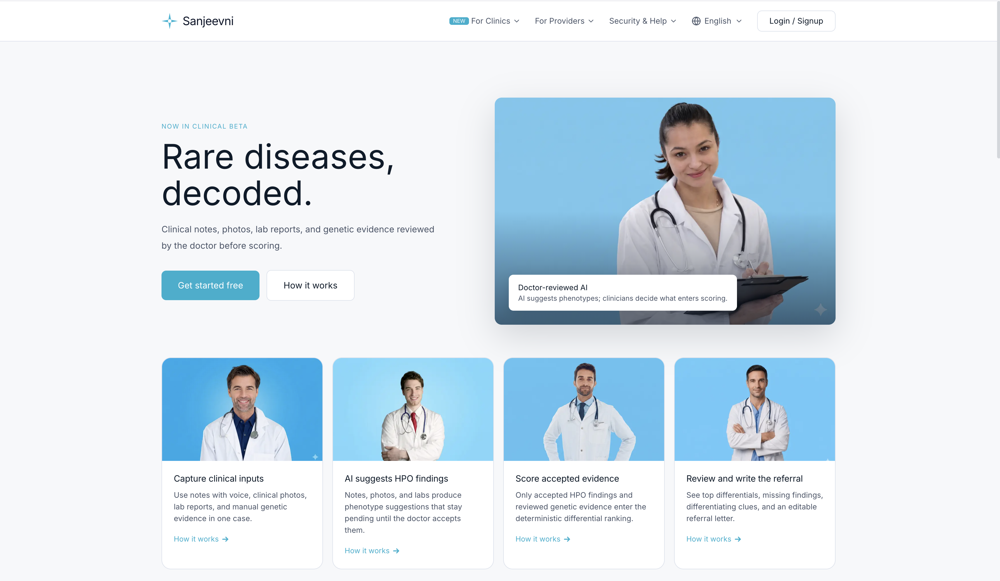
</p>

*Clinical notes, photos, lab reports, and genetic evidence reviewed by the doctor before scoring.*

### Role Selection & Authentication

<table>
  <tr>
    <td align="center" width="50%">
      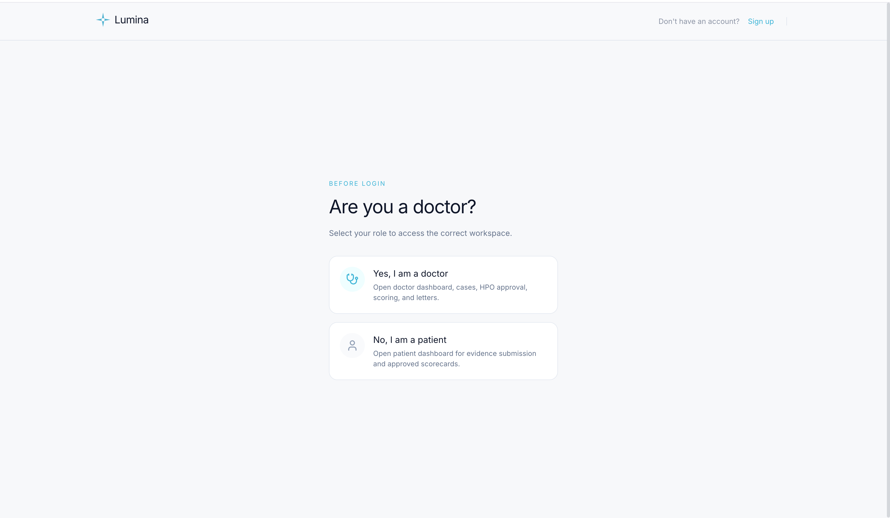<br/>
      <em>Role selection before login</em>
    </td>
    <td align="center" width="50%">
      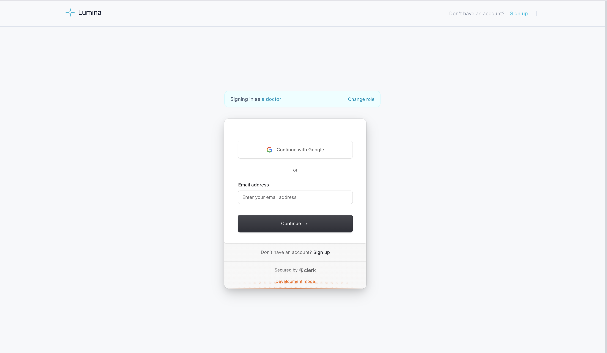<br/>
      <em>Clerk-powered sign-in (doctor role)</em>
    </td>
  </tr>
  <tr>
    <td align="center">
      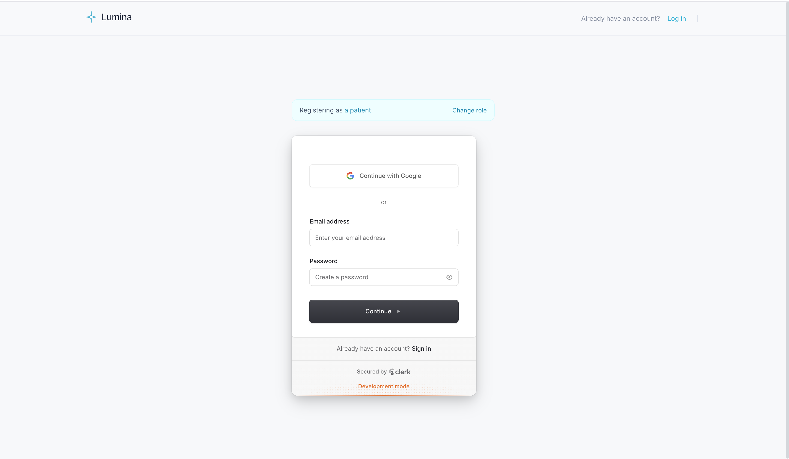<br/>
      <em>Patient registration with Google OAuth</em>
    </td>
    <td align="center">
      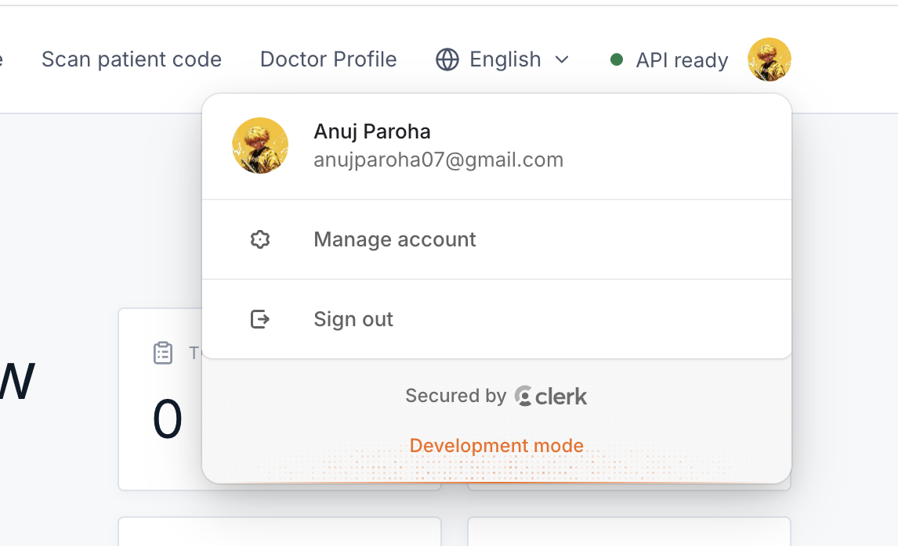<br/>
      <em>Account management via Clerk</em>
    </td>
  </tr>
</table>

### Doctor Workspace

<table>
  <tr>
    <td align="center" width="50%">
      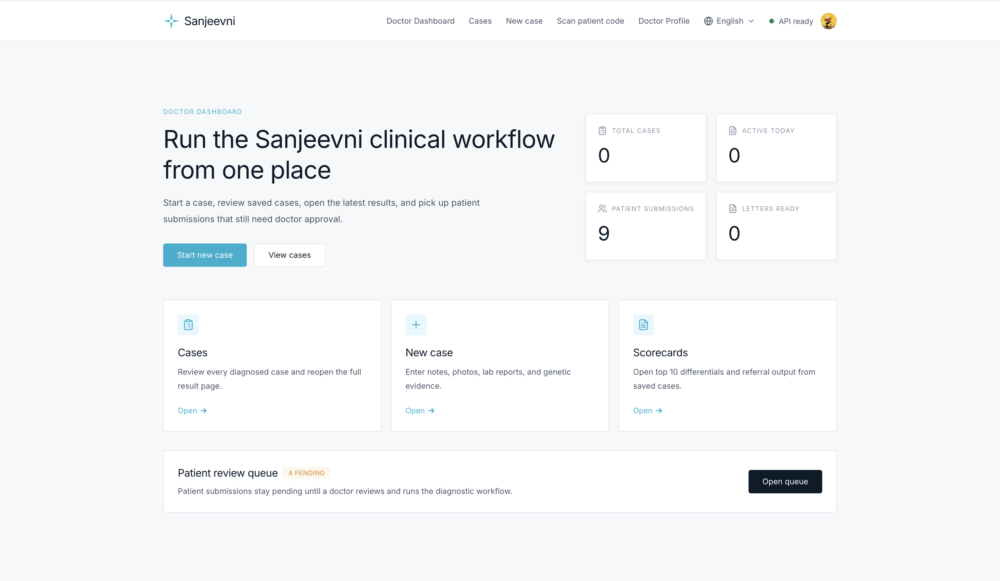<br/>
      <em>Doctor dashboard — cases, submissions, letters</em>
    </td>
    <td align="center" width="50%">
      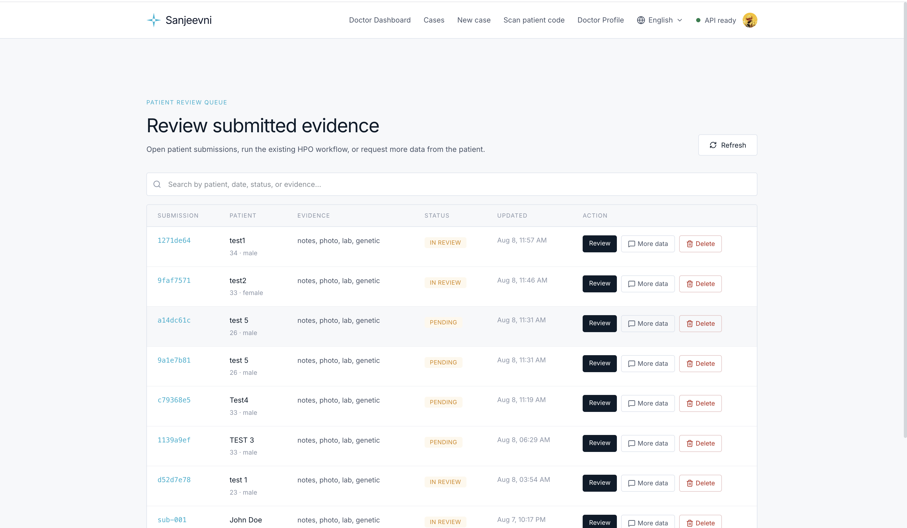<br/>
      <em>Patient review queue with multimodal evidence</em>
    </td>
  </tr>
  <tr>
    <td align="center">
      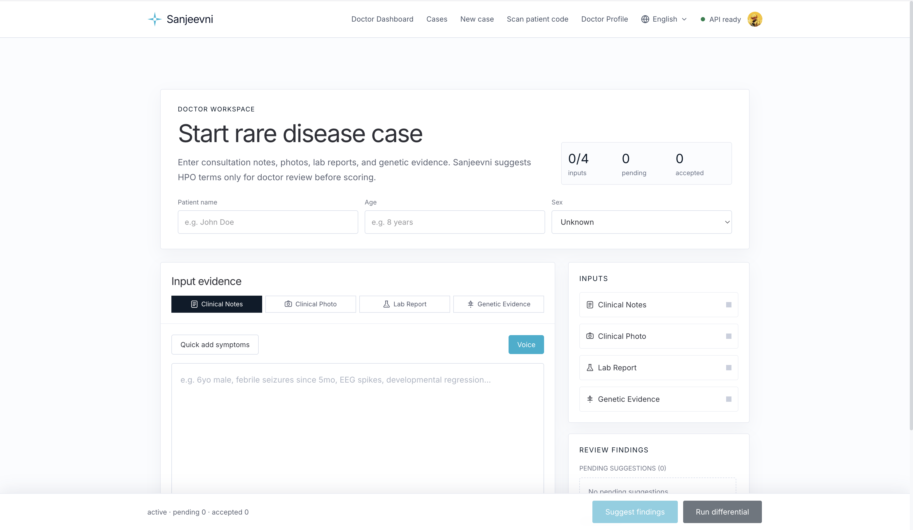<br/>
      <em>New case — notes, photo, lab, genetic evidence</em>
    </td>
    <td align="center">
      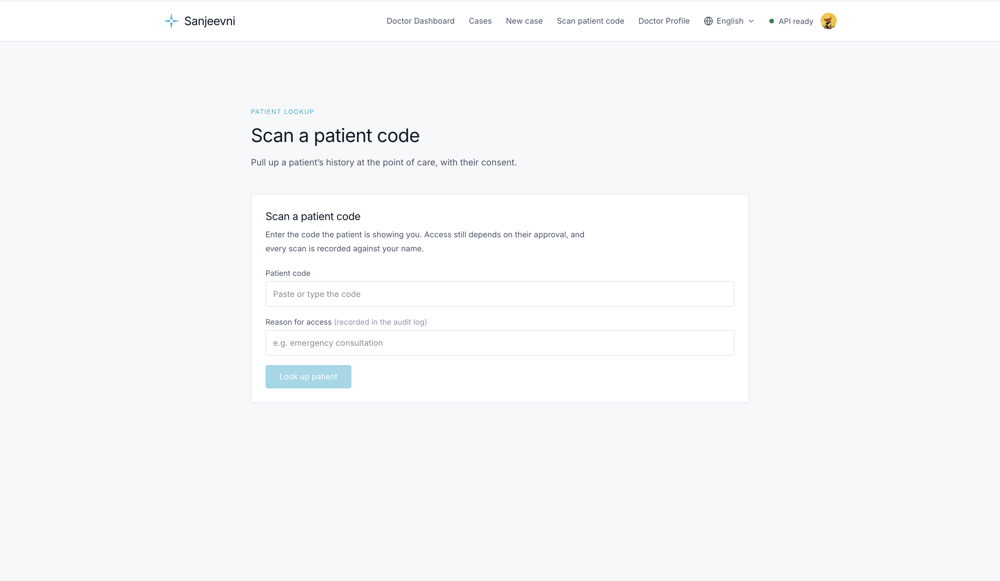<br/>
      <em>Scan patient code at point of care</em>
    </td>
  </tr>
</table>

### Patient Portal

<table>
  <tr>
    <td align="center" width="50%">
      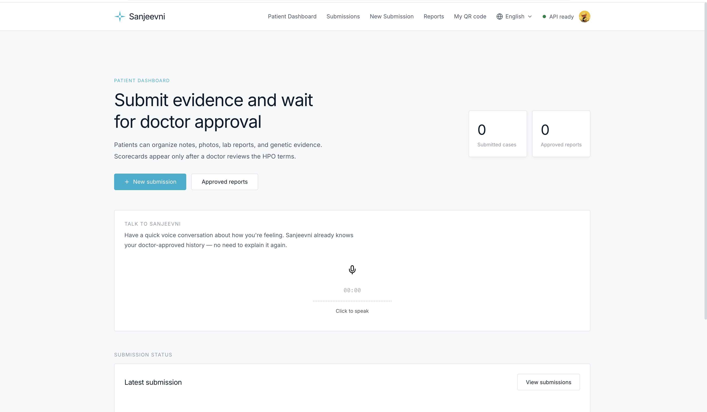<br/>
      <em>Patient dashboard with voice companion</em>
    </td>
    <td align="center" width="50%">
      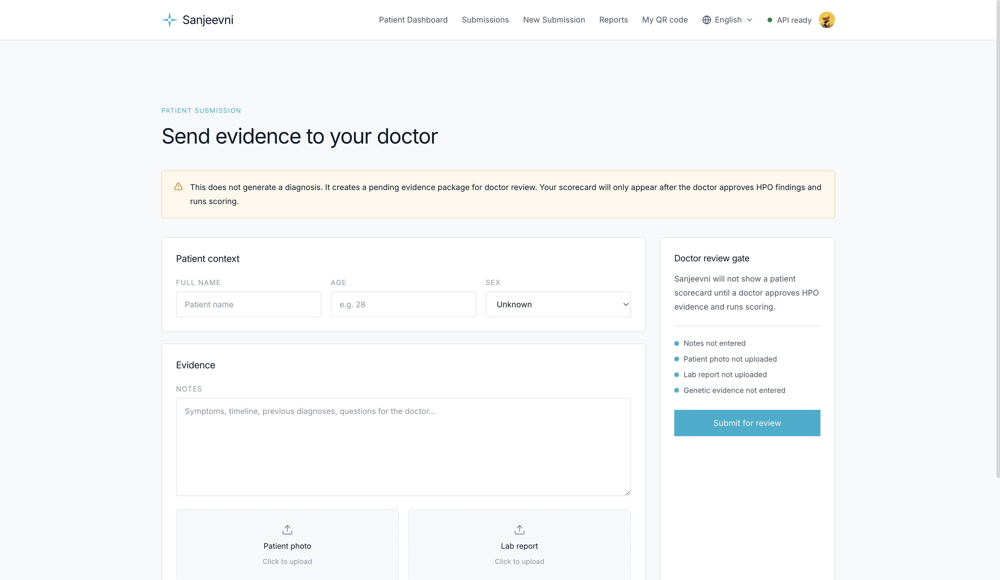<br/>
      <em>Submit evidence for doctor review</em>
    </td>
  </tr>
</table>

### Internationalization

<p align="center">
  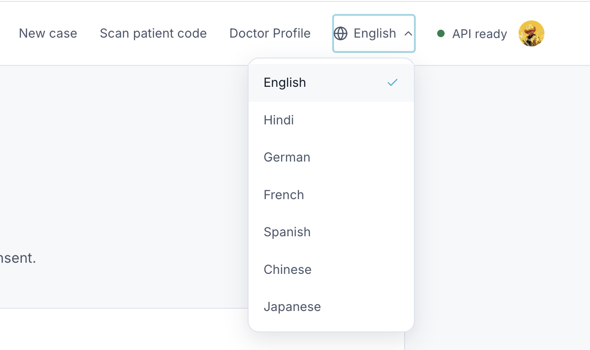
</p>

*Supported locales: English, Hindi, German, French, Spanish, Chinese, Japanese.*

---

## Doctor-in-the-Loop

Sanjeevani operates on a strict **Doctor-in-the-Loop** principle — no unreviewed AI output ever reaches the diagnostic engine:

- AI extracts **candidate** clinical phenotypes from multimodal evidence.
- Clinicians must explicitly **accept** or **reject** every suggested phenotype.
- Rejected and pending phenotypes are **excluded** from disease differential scoring.
- Genetic evidence is integrated to provide diagnostic weighting.
- Patients receive clinician-approved referral documentation **without** raw technical differential rankings.

> **Safety guarantee:** The diagnostic engine is a deterministic algorithm (`ScoringIndex`) using HPO graph information content, semantic graph distances (Jaccard & Lin), and ClinVar genetic variant weightings — not a generic LLM diagnosis.

---

## Patient Workflow

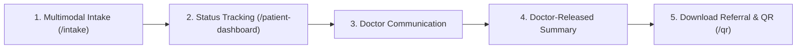

| Route | Purpose |
| --- | --- |
| `/intake` | Submit notes, photos, lab reports, and VCF files |
| `/patient-dashboard` | Track submissions across lifecycle stages |
| `/qr` | Generate QR code for in-clinic history sharing |

**Lifecycle stages:** `submitted` → `under_review` → `case_created` → `released`

**Sample patient personas** (after seeding):

| Patient | ID | Status | Condition |
| --- | --- | --- | --- |
| Alex Mercer | `pat_alex_mercer` | released | Marfan Syndrome (16M) |
| Evan Wright | `pat_evan_wright` | under_review | Fabry Disease (22M) |
| Clara Oswald | `pat_clara_oswald` | submitted | Gaucher Disease Type 1 (42F) |
| Toby Miller | `pat_toby_miller` | released | Duchenne Muscular Dystrophy (5M) |

---

## Doctor Workflow

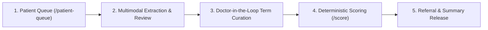

| Route | Purpose |
| --- | --- |
| `/patient-queue` | Review incoming patient submissions |
| `/demo` | 12 pre-loaded clinical demo cases |
| `/cases` | Completed diagnostic cases |
| `/review/[id]` | Multimodal evidence review and HPO curation |

**Sample doctor personas:**

| Doctor | ID | Specialty |
| --- | --- | --- |
| Dr. Sarah Jenkins | `doc_sarah_jenkins` | Clinical Genetics Lead |
| Dr. Marcus Vance | `doc_marcus_vance` | Pediatric Neurology |
| Dr. Elena Rostova | `doc_elena_rostova` | Metabolic Genetics |

---

## Quick Start

### Prerequisites

- **Node.js** v20+
- **pnpm** v9+ (`npm install -g pnpm`)
- **Python** v3.12 or v3.13
- **uv** (recommended): `pip install uv`

### 1. Clone & Install

```bash
git clone https://github.com/vees-1/lumina.git
cd lumina
pnpm install
```

### 2. Seed Sample Data (optional)

```bash
python3 scripts/seed_sample_data.py
```

### 3. Start Backend API

```bash
cd apps/api
uv sync
uv run uvicorn main:app --reload --port 8000
```

API runs at `http://localhost:8000` — interactive docs at `http://localhost:8000/docs`.

**Alternative (all-in-one):**

```bash
./setup.sh run local
```

### 4. Start Frontend

```bash
pnpm --filter web dev
```

Web app runs at `http://localhost:3000`.

---

## Environment Configuration

### Backend (`apps/api/.env`)

```env
GROQ_API_KEY=your_groq_api_key_here
DATABASE_URL=your_supabase_postgres_url   # optional; falls back to SQLite
```

### Frontend (`apps/web/.env.local`)

```env
NEXT_PUBLIC_CLERK_PUBLISHABLE_KEY=your_clerk_publishable_key
CLERK_SECRET_KEY=your_clerk_secret_key
NEXT_PUBLIC_API_URL=http://localhost:8000
```

See [.env.example](.env.example) for a full template.

---

## Repository Structure

```
lumina/
├── apps/
│   ├── api/             # FastAPI service (intake, scoring, agent, FHIR)
│   └── web/             # Next.js 16 frontend (intake, cases, referral, demo)
├── packages/
│   ├── agent/           # Referral letter generation & agent loop
│   ├── extractors/      # Multimodal note, photo, lab, and VCF extractors
│   ├── ingest/          # Knowledge graph models (HPO, Orphanet, ClinVar, FGDD)
│   ├── schemas/         # Shared TypeScript schemas
│   └── scoring/         # HPO similarity ranker & IC scoring engine
├── database/
│   ├── orpha.sqlite     # Knowledge graph (read-only, git LFS)
│   └── lumina_app.sqlite # Runtime app DB
├── scripts/             # HPO index builder, eval, seed data
├── working/             # Brand assets & product screenshots
├── pitch.md             # 3-minute hackathon pitch script
├── prd.md               # Project structure & file map
└── setup.sh             # All-in-one backend setup script
```

---

## Authentication & Authorization

| Tier | Mechanism |
| --- | --- |
| **Web (Next.js)** | Clerk via `@clerk/nextjs` — protects dashboard, cases, intake, patient routes |
| **API (FastAPI)** | Actor-header gate: `x-lumina-user-id` + `x-lumina-role` on every protected endpoint |
| **Roles** | `doctor`, `patient` — role stored in Clerk public metadata or localStorage fallback |

Patients can create, view, and delete their own submissions. Doctors can review, modify, and release submissions. QR access is audited and gated by explicit patient consent.

---

## FAQ

**How does Sanjeevani handle AI hallucinations?**
AI is used solely for candidate term extraction. All phenotypes must be explicitly reviewed and accepted by a clinician before reaching the deterministic scoring engine. Rejected terms are completely filtered out.

**Is Sanjeevani using a generic LLM to output medical diagnoses?**
No. The diagnostic engine uses HPO graph information content, semantic graph distances (Jaccard & Lin), and ClinVar genetic variant weightings.

**How does Sanjeevani protect patient mental health and privacy?**
Raw differential disease probabilities are restricted to the clinician interface. Patients receive only doctor-reviewed summaries and official referral letters. QR codes use randomized tokens with explicit consent controls.

---

## Related Documentation

| Document | Description |
| --- | --- |
| [pitch.md](pitch.md) | Hackathon pitch script, patient/doctor starting guides, demo flow |
| [prd.md](prd.md) | Full project structure, file map, and design decisions |
| [apps/api/README.md](apps/api/README.md) | API service documentation |
| [apps/web/README.md](apps/web/README.md) | Frontend documentation |
| [DATA_SOURCES.md](DATA_SOURCES.md) | Knowledge base data sources |
| [RAILWAY_DEPLOY.md](RAILWAY_DEPLOY.md) | Railway deployment guide |

---

## License

This project is licensed under the MIT License. Sanjeevani is a research prototype intended for clinical decision support and is **not** a certified medical device.
