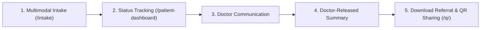
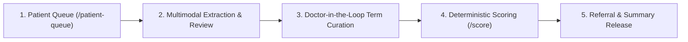

# Lumina — Rare Disease Triage & Clinical Decision Support

> **Complete Hackathon Pitch, Quickstart & Starting Guide**  
> *Target Audience: Hackathon Judges, Evaluating Clinicians, Patients, and Developers*  
> *Core Mission: Shortening the 5-year rare disease diagnostic odyssey through doctor-reviewed AI triage.*

---

## 🚀 Quick Start Instructions

To run the complete Lumina platform locally:

```bash
# 1. Seed sample data into the database
python3 scripts/seed_sample_data.py

# 2. Start Backend (FastAPI on http://localhost:8000)
./setup.sh run local

# 3. Start Frontend (Next.js on http://localhost:3000)
pnpm dev
```

---

## 👤 Starting Guide: Patient View

The Patient View is designed to empower individuals and families seeking answers for rare, complex symptoms without inducing panic or overload.

### 📍 Where to Start (Patient)
- **Primary Route:** `http://localhost:3000/intake` (Intake Submission)
- **Dashboard Route:** `http://localhost:3000/patient-dashboard` (Track Submissions & Summaries)
- **QR Access Route:** `http://localhost:3000/qr` (In-person Consent & QR Sharing)

---

### 🔑 Pre-Loaded Sample Patient Personas

You can test the patient experience using pre-configured sample IDs:

| Patient Name | Patient ID | Status | Condition / Scenario | Key Features to Explore |
| :--- | :--- | :--- | :--- | :--- |
| **Alex Mercer** | `pat_alex_mercer` | `released` | Marfan Syndrome (16M) | View released summary, download referral letter, show QR code |
| **Evan Wright** | `pat_evan_wright` | `under_review` | Fabry Disease (22M) | View active doctor messages, pending enzyme assay requests |
| **Clara Oswald** | `pat_clara_oswald` | `submitted` | Gaucher Disease Type 1 (42F) | View intake in queue waiting for doctor assignment |
| **Toby Miller** | `pat_toby_miller` | `released` | Duchenne Muscular Dystrophy (5M) | Complete referral & longitudinal history summary |

---

### 🔄 Patient Step-by-Step Flow



1. **Multimodal Intake Submission (`/intake`):**
   - Patients or caregivers enter unstructured clinical notes, upload symptom photos (e.g., skin lesions, facial features), lab reports (PDF), or genetic VCF files.
   - Multi-modal inputs are automatically processed by backend AI extractors into candidate Human Phenotype Ontology (HPO) terms.

2. **Submission Tracking (`/patient-dashboard`):**
   - Patients track progress across 4 clear lifecycle stages: `submitted` ➔ `under_review` ➔ `case_created` ➔ `released`.
   - Real-time notifications display when a clinician reviews or requests additional information.

3. **Doctor Communication & Additional Data:**
   - Patients view doctor notes (e.g., *"Please upload your recent echocardiogram report"*).
   - Messaging ensures patients remain informed without exposure to unreviewed diagnostic probabilities.

4. **Doctor-Approved Patient Summary:**
   - Once released by the reviewing clinician, the patient receives a plain-language summary detailing confirmed phenotypes and next steps.
   - **Panic Safeguard:** Raw diagnostic rankings and statistical confidence scores are strictly hidden from patient views.

5. **Specialist Referral & QR Sharing (`/qr`):**
   - Patients can view and print their single-page Specialist Referral Letter.
   - Patients generate an opaque QR code (`LUMINA-QR-ALEX-9921`) to securely grant treating doctors instant access to their unified medical history during clinic visits.

---

## 🩺 Starting Guide: Doctor View

The Doctor View provides clinicians with an AI-assisted, doctor-in-the-loop workspace to review evidence, curate phenotypes, execute similarity scoring against the Orphanet knowledge graph, and issue referral letters.

### 📍 Where to Start (Doctor)
- **Triage Queue Route:** `http://localhost:3000/patient-queue` (Incoming Submissions)
- **Live Demo Cases:** `http://localhost:3000/demo` (12 Pre-loaded Clinical Cases)
- **Case Management:** `http://localhost:3000/cases` (Completed Diagnostic Cases)

---

### 🔑 Pre-Loaded Sample Doctor Personas

| Doctor Name | Doctor ID | Specialty | Associated Cases |
| :--- | :--- | :--- | :--- |
| **Dr. Sarah Jenkins** | `doc_sarah_jenkins` | Clinical Genetics Lead | Marfan Syndrome, Gaucher Disease |
| **Dr. Marcus Vance** | `doc_marcus_vance` | Pediatric Neurology | Dravet Syndrome, Duchenne Muscular Dystrophy |
| **Dr. Elena Rostova** | `doc_elena_rostova` | Metabolic Genetics | Fabry Disease |

---

### 🔄 Doctor Step-by-Step Flow



1. **Clinical Triage Queue (`/patient-queue`):**
   - Doctors review pending patient submissions sorted by timestamp, status, and urgency.
   - Select any case (e.g., Alex Mercer or Clara Oswald) to initiate clinical review.

2. **Multimodal Evidence Review (`/review/[id]`):**
   - Clinicians view extracted phenotype terms across all submitted modalities:
     - **Text Notes:** HPO term extraction via NLP.
     - **Photos:** Facial dysmorphology and skin lesion feature extraction.
     - **Lab Reports:** Tesseract OCR text extraction + clinical entity parsing.
     - **Genetic VCF:** ClinVar pathogenic variant mapping (e.g., *FBN1*, *SCN1A*, *GLA*, *DMD*).

3. **Doctor-in-the-Loop Phenotype Curation (Core Innovation):**
   - Clinicians click **Accept** on true phenotypes and **Reject** on false positives or noisy AI suggestions.
   - **Safety Guarantee:** Unapproved or rejected terms are strictly excluded from downstream diagnostic scoring, preventing AI hallucination propagation.

4. **Deterministic Similarity Scoring (`/score`):**
   - Click **Run Scoring** to evaluate the accepted HPO terms against the entire Orphanet rare disease database (7,000+ diseases).
   - Lumina computes Information Content (IC), Jaccard similarity, and Lin semantic distance, producing ranked candidate diseases with transparent matched vs. missing symptom breakdowns.

5. **Referral Letter & Patient Summary Release:**
   - Auto-generate a structured specialist referral letter (Markdown & PDF).
   - Review and edit the draft, then click **Release to Patient** to push the approved summary to the patient's dashboard.

6. **QR History Scanning & Consent Audit:**
   - Doctors can scan a patient's presented QR code to request instant access to longitudinal history.
   - Access is audited and gated by explicit patient consent.

---

## 🎯 3-Minute Live Pitch Script

### 0:00 – 0:30 | The Hook & Narrative
> *"300 million people worldwide live with a rare disease. Getting a diagnosis takes an average of 5 years, 8 doctors, and multiple misdiagnoses because no human doctor can memorize 7,000 rare diseases. Meet **Lumina** — a doctor-reviewed rare disease triage platform that turns scattered patient evidence into structured diagnoses and specialist referral letters in minutes instead of years."*

### 0:30 – 1:00 | Multimodal Intake
> *"Clinical evidence comes in all forms: notes, photos, lab reports, and VCF genetic files. Lumina ingests all these modalities at once, automatically extracting Human Phenotype Ontology terms."*

### 1:00 – 1:30 | Doctor-in-the-Loop Safeguard
> *"Here is our core innovation for patient safety: **No unreviewed AI output ever reaches the diagnostic engine.** Clinicians interactively accept valid phenotypes and reject false ones. AI suggests, but the doctor decides."*

### 1:30 – 2:00 | Diagnostic Scoring & Explainability
> *"Using doctor-approved terms, Lumina scores the Orphanet knowledge graph in real time using Information Content semantic metrics. It doesn't just output a guess — it shows why, displaying matched symptoms, missing findings, and distinguishing features."*

### 2:00 – 2:30 | Referral Generation & Patient Dashboard
> *"Lumina generates a single-page specialist referral letter for the clinician. Crucially, patients receive a clear summary note on their dashboard without raw confidence scores that could cause panic."*

### 2:30 – 3:00 | Architecture & Conclusion
> *"Built with Next.js, FastAPI, SQLModel Orphanet knowledge graphs, and custom similarity rankers, Lumina is a production-ready clinical decision-support prototype. Thank you!"*

---

## ❓ Frequently Asked Questions (FAQ)

> [!IMPORTANT]
> **How does Lumina handle AI hallucinations in diagnosis?**  
> Lumina uses AI solely for candidate term extraction. All extracted phenotypes must be explicitly reviewed and accepted by a clinician before reaching the deterministic scoring engine. Rejected terms are completely filtered out.

> [!TIP]
> **Is Lumina using a generic LLM to output medical diagnoses?**  
> No. The diagnostic engine is a deterministic algorithm (`ScoringIndex`) using HPO graph information content, semantic graph distances (Jaccard & Lin), and ClinVar genetic variant weightings.

> [!NOTE]
> **How does Lumina protect patient mental health and privacy?**  
> Raw differential disease probabilities are restricted to the clinician interface. Patients receive only doctor-reviewed summaries and official referral letters. QR codes use randomized tokens with explicit consent controls.

---

## 📁 Related Documentation & Files

- [database_schema.sql](file:///Users/ayushparoha/Documents/Lumina-Rare-Disease-Triage/database_schema.sql) — App SQLite Schema
- [database_data_dump.sql](file:///Users/ayushparoha/Documents/Lumina-Rare-Disease-Triage/database_data_dump.sql) — Exported Database Dump with Seed Data
- [seed_sample_data.py](file:///Users/ayushparoha/Documents/Lumina-Rare-Disease-Triage/scripts/seed_sample_data.py) — Database Seeding Script
- [demo-cases.ts](file:///Users/ayushparoha/Documents/Lumina-Rare-Disease-Triage/apps/web/src/lib/demo-cases.ts) — Pre-loaded Demo Clinical Cases
